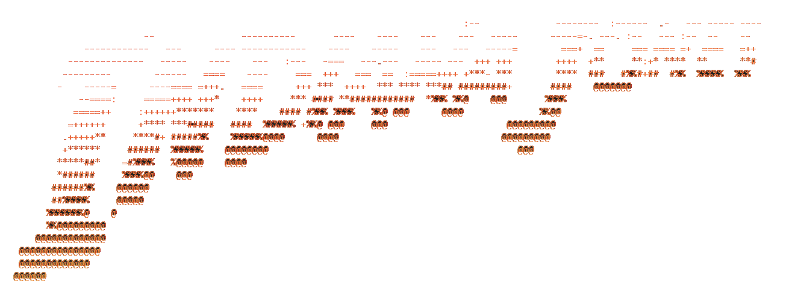

<div align="center">



**Automatische Cheat-Code-Eingabe für _LEGO Indiana Jones: Die legendären Abenteuer_**

[English](../README.md) · [Français](README.fr.md) · **Deutsch** · [Español](README.es.md) · [Italiano](README.it.md) · [日本語](README.ja.md) · [한국어](README.ko.md) · [Русский](README.ru.md) · [中文](README.zh.md)

</div>

## Was ist indicode?

In _LEGO Indiana Jones: Die legendären Abenteuer_ werden Cheat-Codes über ein Rad mit
6 Zeichen im Klassenzimmer des Barnett College eingegeben, wobei jedes Zeichen einzeln
nach oben oder unten gescrollt wird. Das von Hand zu machen ist langsam und fehleranfällig.

**indicode** erledigt das für dich. Du wählst die gewünschten Codes aus, es berechnet den
kürzesten Weg zwischen den Zeichen und simuliert dann die Tastenanschläge, um sie
automatisch einzugeben – einen Code nach dem anderen.

## Demo

<a href="https://youtu.be/N4DFVwdnXN0">
    
</a>


## Funktionen

- **Eingabe in einem Rutsch** — mehrere Codes auswählen und nacheinander eingeben lassen.
- **Kürzeste-Wege-Navigation** — wählt für jedes Zeichen hoch oder runter, um Bewegungen zu minimieren.
- **Eigene Tastenbelegung** — konfiguriere deine Tasten für hoch / rechts / runter / links / Bestätigen.
- **Startverzögerung & Countdown** — gibt dir Zeit, zurück ins Spiel zu wechseln.
- **9 Sprachen** — Englisch, Französisch, Deutsch, Spanisch, Italienisch, Japanisch, Koreanisch, Russisch, Chinesisch (automatisch erkannt).

## Voraussetzungen

- Python 3.10+
- [`pynput`](https://pypi.org/project/pynput/) und [`colorama`](https://pypi.org/project/colorama/)

```bash
pip install -r requirements.txt
```

## Verwendung

```bash
python main.py
```

1. Wähle die gewünschten Codes (`a` für alle auswählen, `v` zum Bestätigen).
2. Konfiguriere deine Tasten (hoch, rechts, runter, links, Bestätigen).
3. Lege eine Startverzögerung fest und wechsle dann ins Spiel, mit der Tafel auf `(A) A A A A A`.
4. Lehn dich zurück, während indicode alles eingibt.

> Erzwinge die Sprache mit der Umgebungsvariable `INDICODE_LANG` (z. B. `INDICODE_LANG=de`).


